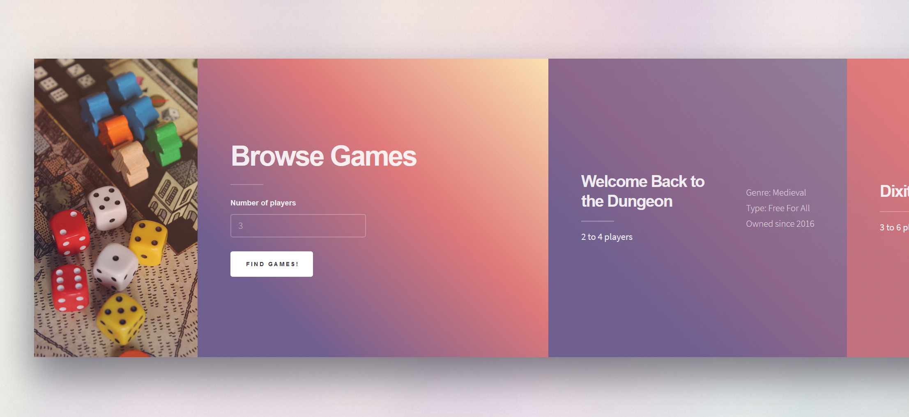

# Games Database

A clearly over-engineered solution to find a board game we can play given a number of players.

## Run the server

You should first [install Django](https://www.djangoproject.com/start/).

Also install `python -m pip install django-cors-headers` to access the BGG API.

Then you should be able to run `python manage.py runserver`.

You will probably need to migrate things using `python manage.py makemigrations` and `python manage.py migrate`.

Database is modified through the Django admin UI, which you can access by creating a super user: `python manage.py createsuperuser`. With the server running, you will then be able to access `http://localhost:8000/admin/` in your browser of choice, so you may add your games in the database.

## Using the service

Once the database is set up, simply access `http://localhost:8000/games/` and type in the number of players. The list of games to the right of the page is updated with all the games in your database you can play given the number of players you entered, along with some extra information about each game.

## Resources

The HTML template comes from [HTML5 UP](https://html5up.net/), and the image to the right is from [Unsplash](https://unsplash.com/photos/laNNTAth9vs). Coding pretty much followed the [Django tutorial](https://docs.djangoproject.com/en/2.2/intro/tutorial01/), with help from the internet here and there.

## Future work

* Pulling images online given the name of the game
* Grab other information about each game (e.g. rating on different website)
* Make the page load seamless across queries (currently id fades in and out, not the best UX)
